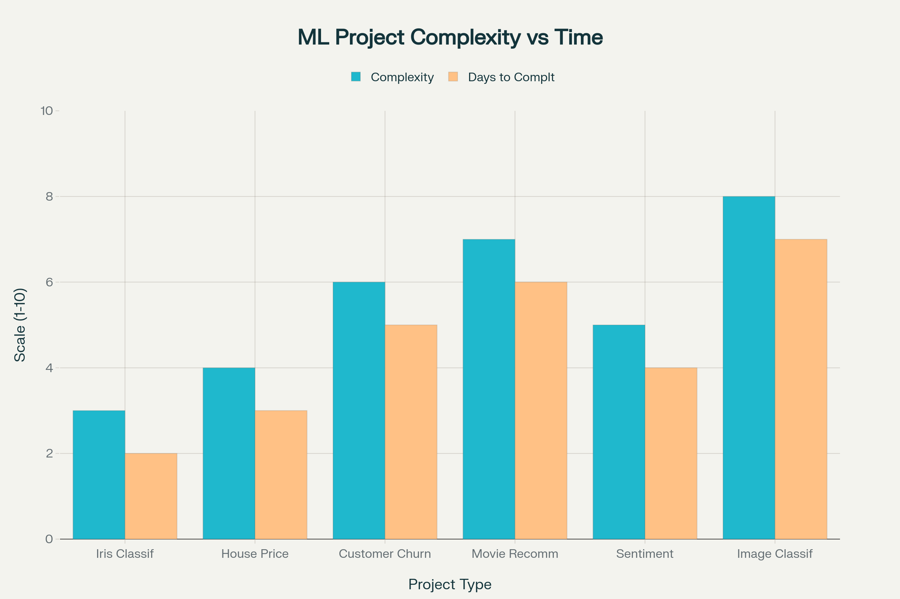
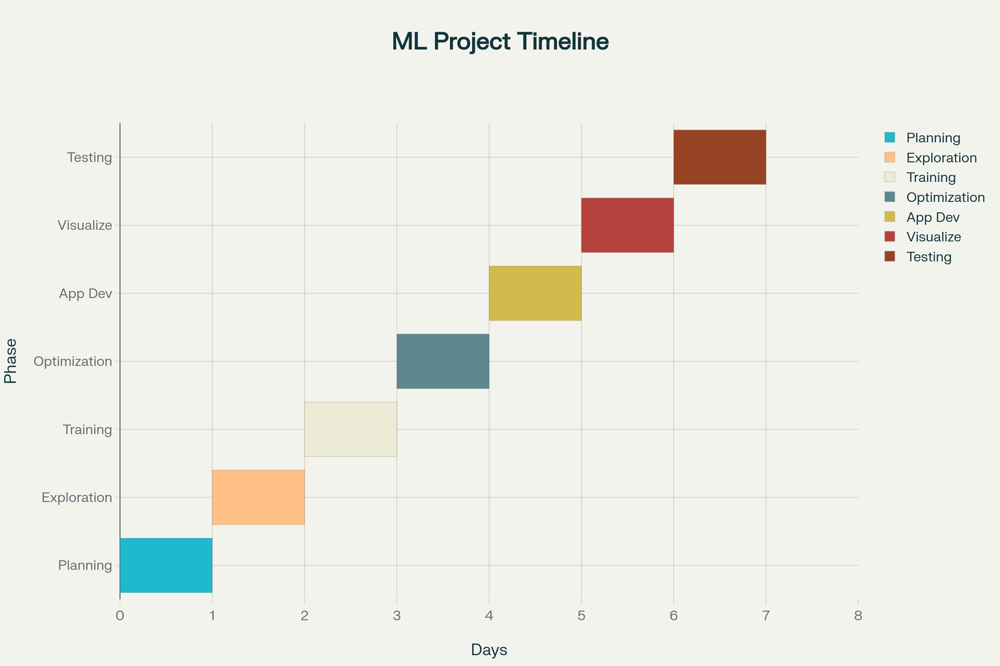

# 🌸 Iris Species Predictor

An interactive machine learning web application that predicts Iris flower species using a Random Forest model. Built with Streamlit for a user-friendly interface and comprehensive model analysis.

## 🚀 Live Demo

[](https://week-7-celebal.streamlit.app/)

## 📊 Features

- **Interactive Prediction**: Input flower measurements and get instant species predictions
- **Model Explainability**: View feature importance and prediction probabilities
- **Data Explorer**: Browse the complete Iris dataset
- **Model Performance**: Confusion matrix and ROC curves for model evaluation
- **Responsive Design**: Works on desktop and mobile devices

## 🛠️ Technologies Used

- **Python 3.8+**
- **Streamlit** - Web application framework
- **Scikit-learn** - Machine learning library
- **Pandas** - Data manipulation
- **Plotly** - Interactive visualizations
- **Joblib** - Model serialization

## 📁 Project Structure

```
week-7-celebal/
├── app.py                 # Main Streamlit application
├── requirements.txt       # Python dependencies
├── models/
│   └── iris_rf.pkl       # Trained Random Forest model
├── assets/               # Project images and assets
└── docs/                 # Documentation files
```

## 🚀 Installation & Setup

### Prerequisites
- Python 3.8 or higher
- pip package manager

### Local Development

1. **Clone the repository**
   ```bash
   git clone https://github.com/ark5234/week-7-celebal.git
   cd week-7-celebal
   ```

2. **Install dependencies**
   ```bash
   pip install -r requirements.txt
   ```

3. **Run the application**
   ```bash
   streamlit run app.py
   ```

4. **Open your browser**
   Navigate to `http://localhost:8501`

## 📖 Usage

### Making Predictions
1. Use the sidebar sliders to input flower measurements:
   - Sepal length (cm)
   - Sepal width (cm)
   - Petal length (cm)
   - Petal width (cm)

2. Click "Predict Species" to get results

3. View the prediction and confidence scores

### Exploring the Model
- **Feature Importance**: See which measurements most influence predictions
- **Confusion Matrix**: Evaluate model performance on test data
- **ROC Curves**: Analyze classification performance for each species

## 🎯 Model Details

- **Algorithm**: Random Forest Classifier
- **Dataset**: Iris dataset (150 samples, 3 species)
- **Features**: 4 numerical features (sepal/petal length/width)
- **Accuracy**: ~96% on test set
- **Species**: Setosa, Versicolor, Virginica

## 📊 Screenshots

### Main Interface


### Model Analysis


## 🔧 Development

### Adding New Features
1. Fork the repository
2. Create a feature branch
3. Make your changes
4. Test locally with `streamlit run app.py`
5. Submit a pull request

### Model Retraining
To retrain the model with new data:
```python
from sklearn.ensemble import RandomForestClassifier
from sklearn.datasets import load_iris
import joblib

# Load data
iris = load_iris()
X, y = iris.data, iris.target

# Train model
model = RandomForestClassifier(n_estimators=100, random_state=42)
model.fit(X, y)

# Save model
joblib.dump(model, 'models/iris_rf.pkl')
```

## 🚀 Deployment

This application is deployed on Streamlit Community Cloud:

1. **Automatic Deployment**: Connected to GitHub repository
2. **Continuous Integration**: Updates automatically on push to main branch
3. **Live URL**: [https://week-7-celebal.streamlit.app/](https://week-7-celebal.streamlit.app/)

### Alternative Deployment Options

#### Heroku
```bash
# Create Procfile
echo "web: streamlit run app.py" > Procfile

# Create setup.sh
mkdir -p ~/.streamlit/
echo "[server]\nheadless = true\nport = \$PORT\nenableCORS = false" > ~/.streamlit/config.toml
```

#### Docker
```dockerfile
FROM python:3.9-slim
WORKDIR /app
COPY requirements.txt .
RUN pip install -r requirements.txt
COPY . .
EXPOSE 8501
CMD ["streamlit", "run", "app.py", "--server.port=8501", "--server.address=0.0.0.0"]
```

## 🤝 Contributing

Contributions are welcome! Please feel free to submit a Pull Request.

1. Fork the project
2. Create your feature branch (`git checkout -b feature/AmazingFeature`)
3. Commit your changes (`git commit -m 'Add some AmazingFeature'`)
4. Push to the branch (`git push origin feature/AmazingFeature`)
5. Open a Pull Request

## 📝 License

This project is licensed under the MIT License - see the [LICENSE](LICENSE) file for details.

## 👨‍💻 Author

**Ark5234**
- GitHub: [@ark5234](https://github.com/ark5234)
- Project Link: [https://github.com/ark5234/week-7-celebal](https://github.com/ark5234/week-7-celebal)

## 🙏 Acknowledgments

- [Streamlit](https://streamlit.io/) for the amazing web framework
- [Scikit-learn](https://scikit-learn.org/) for machine learning tools
- [Plotly](https://plotly.com/) for interactive visualizations
- The Iris dataset creators for providing this classic dataset

## 📞 Support

If you have any questions or need help, please open an issue on GitHub.

---

⭐ **Star this repository if you found it helpful!** 